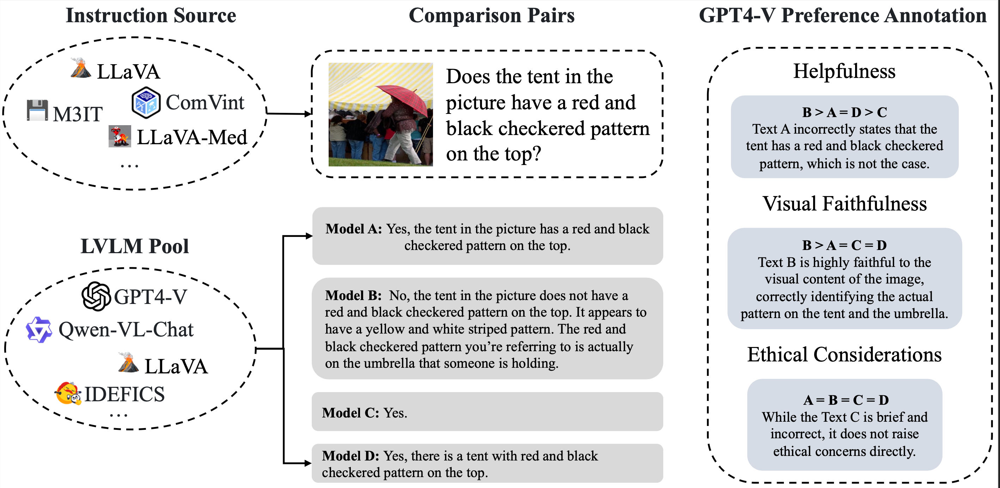
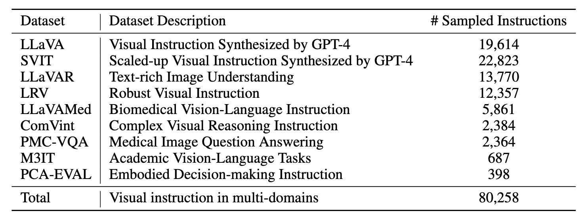
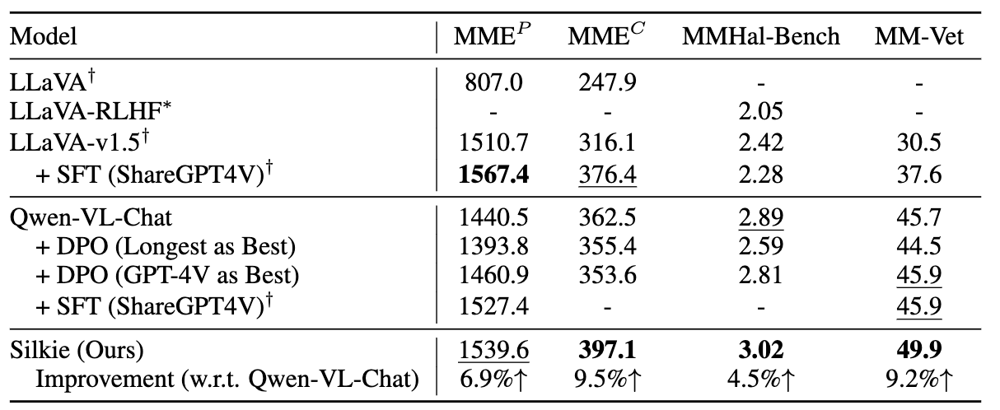

# VLFeedback

A GPT-4V annotated preference dataset for large vision language models. 

[[Project Page]](https://vlf-silkie.github.io)  [[Datasets]](https://huggingface.co/datasets/MMInstruction/VLFeedback) [[Silkie Model]](https://huggingface.co/MMInstruction/Silkie) [[Paper]]()


Generated by [DALL·E 3](https://openai.com/dall-e-3)

## Annotation Framework 




### Multimodal Instruciton Source

The instructions are sampled from various domains to cover different capabilities of LVLMs





### Model Pool

We construct a model pool consists of 12 LVLMs, including

- GPT-4V
- LLaVA-series
  - LLaVA-v1.5-7B
  - LLaVA-v1.5-13B
  - LLaVA-RLHF-7b-v1.5-224
  - LLaVA-RLHF-13b-v1.5-336
- Qwen-VL-7B
- IDEFICS-9b-Instruct
- Fuyu-8B
- InstructBLIP-serise
  - InstructBLIP-Vicuna-7B
  - InstructBLIP-Vicuna-13B
- VisualGLM-6B
- MMICL-Vicuna-13B


## Silkie

We select Qwen-VL-Chat as the backbone model and perform DPO on our dataset.

The resulting model, Silkie, achieves comprehensive improvements on various benchmarks





## Citations

```bib
Coming soon
```
